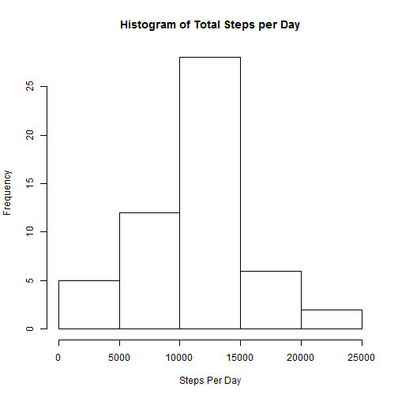
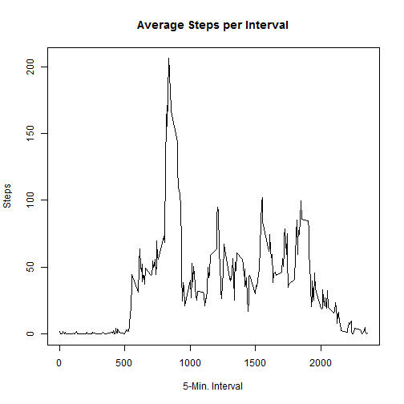
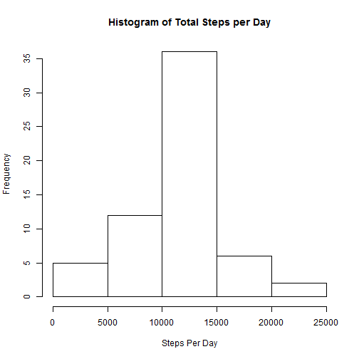
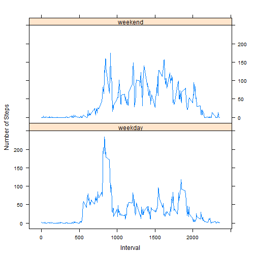

# Reproducible Research: Peer Assessment 1
This assignment makes use of data from a personal activity monitoring device. This device collects data at 5 minute intervals through out the day. The data consists of two months of data from an anonymous individual collected during the months of October and November, 2012 and include the number of steps taken in 5 minute intervals each day.

Three variables are included in the dataset:
- steps: Number of steps taking in a 5-minute interval (missing values are coded as NA)
- date: The date on which the measurement was taken in YYYY-MM-DD format
- interval: Identifier for the 5-minute interval in which measurement was taken

The dataset is stored in a comma-separated-value (CSV) file and there are a total of 17,568 observations in this dataset.

## Loading and preprocessing the data
Load required packages

```r
library(lattice)
library(ggplot2)
```

```
## Warning: package 'ggplot2' was built under R version 3.1.1
```
Load the sample data from the activity.csv file:

```r
act_data <- read.csv("activity.csv")
```
Convert the date factor in the data.frame to the *Date* class:

```r
act_data$date <- as.Date(act_data$date, "%Y-%m-%d")
```
## What is mean total number of steps taken per day?
Calculate steps per day

```r
stepsperday <- aggregate(steps ~ date, data=act_data, sum)
```
Plot histogram of steps per day

```r
hist(stepsperday$steps,xlab="Steps Per Day", main="Histogram of Total Steps per Day")
```

 

Calculate the mean and median steps per day

```r
meanStepsPerDay <- mean(stepsperday$steps)
medianStepsPerDay <- median(stepsperday$steps)
```

The mean steps per day is 1.0766 &times; 10<sup>4</sup> and the median steps per day is 10765

## What is the average daily activity pattern?
Find the mean per interval

```r
mpi <- aggregate(steps ~ interval, data=act_data, mean)
```
Create time series plot of 5-minute interval and average number of steps taken

```r
plot(mpi$interval, mpi$steps, type="l", xlab="5-Min. Interval", 
     ylab="Steps", main="Average Steps per Interval")
```

 

Determine which 5-minute interval contains the maximum number of steps.

```r
which.max(mpi$steps)
```

```
## [1] 104
```
## Imputing missing values
Determine the number of missing values in the dataset

```r
total_values <- nrow(act_data)
missing_values <- sum(is.na(act_data$steps))
```
There are 17568 values in the dataset with 2304 missing values.

Impute data values using the mean value of the corresponding interval.

```r
act_data_imp <- merge(act_data, mpi, by="interval", suffixes=c("",".y"),all=TRUE)
na_idx <- is.na(act_data_imp$steps)
act_data_imp$steps[na_idx] <- act_data_imp$steps.y[na_idx]
act_data_imp <- act_data_imp[,c(1:3)]
```
Use the imputed dataset to generate steps per day, mean, and median values.

Calculate steps per day for imputed data

```r
stepsperdayimp <- aggregate(steps ~ date, data=act_data_imp, sum)
```
Plot histogram of steps per day

```r
hist(stepsperdayimp$steps,xlab="Steps Per Day", main="Histogram of Total Steps per Day")
```

 

Calculate the mean and median steps per day, and the difference using imputed values.

```r
meanStepsPerDayImp <- mean(stepsperdayimp$steps)
medianStepsPerDayImp <- median(stepsperdayimp$steps)
meanDiff <- meanStepsPerDayImp - meanStepsPerDay
medianDiff <- medianStepsPerDayImp - medianStepsPerDay
```

For the imputed dataset, the mean steps per day is 1.0766 &times; 10<sup>4</sup> and the median steps per day is 1.0766 &times; 10<sup>4</sup>. The difference in mean values is 0 and the difference in median values is 1.1887. This data is relatively close to the initial values, so there was a minimal impact of imputing missing data, when using the mean value of the corresponding interval.

## Are there differences in activity patterns between weekdays and weekends?
Create a new factor variable to differentiate weekdays from weekends.

```r
act_data$dow <- weekdays(act_data$date)
act_data$wkf <- "weekday"
wknd <- grep("^S", act_data$dow)
act_data[wknd,]$wkf <- "weekend"
```
Find the mean per interval

```r
mpi <- aggregate(steps ~ interval + wkf, data=act_data, mean)
```
Plot the results for weekdays and weekends.

```r
xyplot(mpi$steps ~ mpi$interval | mpi$wkf, type="l", layout=c(1,2), xlab="Interval", 
     ylab="Number of Steps")
```

 
